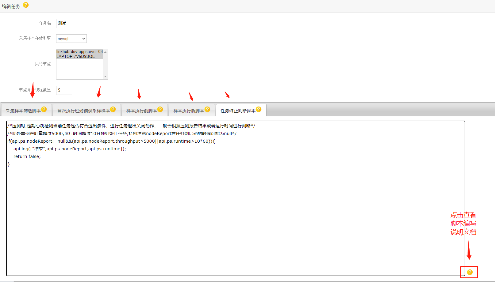

# 任务编写脚本示例说明
 为了让压测有更好的通用性，同时可以定制各种场景适配，所以压测底层抽象出几种可能需要定制的功能去增强！此文档举例一些场景和demo，方便用户快速上手！
## 定制脚本
总共有5个脚本会涉及到编写（如图），点击右下角有脚本编写的详细说明文档（如图）！

[脚本编写详解](/lmc-autotest-provider/src/main/resources/static/content/readme.html)
* 表面上支持js es5的语法,原理是底层采用java nashorn script engine进行解析，所以脚本执行就看本身引擎解析的能力了，比如JSON.parse等原生的函数也是支持的。
* 底层也扩展了自定义的一些函数方法，比如api,streamSql2,api.writeSample,api.log,api.error,api.debug,api.nowFormat,api.ps.*等扩展，详细请看管理站点中的文档为准！

#### 1. 采集样本筛选脚本示范
```
   /*通过sql流处理分批获取样本数据，然后写入到本地样本(sample)文件中*/
   api.streamSql2("select * from auto_tb_sample_"+api.nowFormat("yyyy_MM_dd")+" where url like '%192.168%' and url like '%get%'",[],function (dataMap){
   api.writeSample(dataMap);
   })
   ```
#### 2. 首次执行过滤错误采样样本
```
   /*在样本筛选的基础上,对本地样本文件中的部分请求进行过滤，比如特定业务请求或者错误请求或者无法访问的请求等*/
   var r = api.ps.response;
   if(r==null||r.code!=200)
   {
   /*api.error(["过滤错误请求",r]);*/
   return false;
   }
   var r2 = JSON.parse(r.body);
   if(r2==null||r2.code!=200)
   {
   /*api.error(["过滤错误业务请求",r]);*/
   return false;
   }
```
#### 3. 样本执行前脚本
```
   /*可以对单个样本在压测时进行判别过滤，比如直接跳过部分请求不进行压测等，用的场景比较少*/
```
#### 4. 样本执行后脚本
```
   /*对压测时，部分样本请求的结果进行过滤，比如直接判别为错误请求或者跳过不计算在report中，或者直接打印请求结果进行调试*/
   /*var r = api.ps.response;*/
   /*api.debug(["显示调试请求",r]);*/
```
#### 5. 任务终止判断脚本
```
   /*压测时,定期心跳检测当前任务是否符合退出条件，进行任务退出关闭动作，一般会根据压测报告结果或者运行时间进行判断*/
   /*此处举例吞吐量超过5000,运行时间超过10分钟则终止任务,特别注意nodeReport在任务刚启动的时候可能为null*/
   if(api.ps.nodeReport!=null&&(api.ps.nodeReport.throughput>5000||api.ps.runtime>10*60)){
   api.log(["结束",api.ps.nodeReport,api.ps.runtime]);
   return false;
   }
```
#### 6. 其他脚本示例
```
  /*飞书通知*/
 var content = "节点:"+api.ps.node.node+"通知任务开启压测:taskid="+api.ps.task.id;
 api.httpPost("https://open.feishu.cn/open-apis/bot/v2/hook/6c26281e-20cf-46db-b4ec-a4ad8a3963e1",{"msg_type":"text","content":{"text":content}});
```


by 车江毅