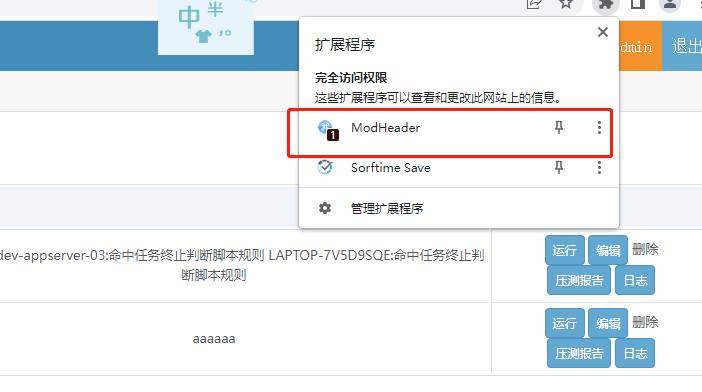
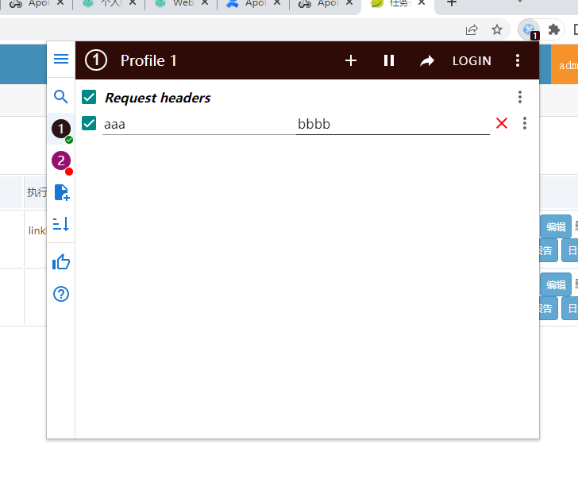
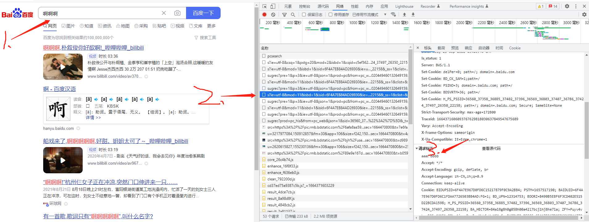
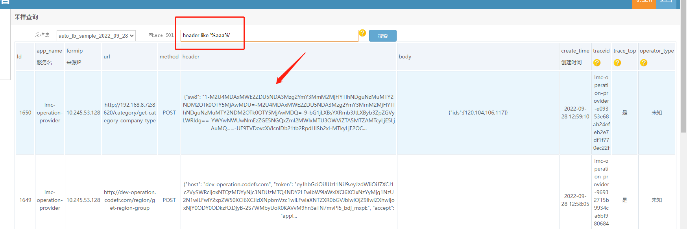

# 全链路压测工具定向录制流量
 原理：采用浏览器插件的方式,添加定制header的方式录制特定场景流量，后续通过样本筛选出这部分场景流量，从而实现特定流量（场景）压测。
 这里以浏览器chrome的插件modheader插件举例。

## chrome ModHeader插件
1. 下载插件（[chrome 如何安装插件教程](https://baijiahao.baidu.com/s?id=1714127233056673152&wfr=spider&for=pc )）
* [点击chrome插件下载](doc/modheader/idgpnmonknjnojddfkpgkljpfnnfcklj_4.0.14_chrome.zzzmh.cn.crx)
## 打开插件

## 设置插件头，以aaa:bbbb header为例

##  验证header请求是否传入定制头

##  自动化测试搜索录制的api请求(筛选样本)

by [车江毅](https://www.cnblogs.com/chejiangyi/)