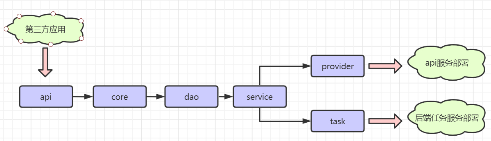

# lmc-autotest
 基于<a href='https://gitee.com/chejiangyi/free-bsf-all/tree/1.0-SNAPSHOT/'>BSF基础框架</a>，<a href='http://gitlab.codefr.com/linkhub-public/lmc-business-all'>Business业务基础框架</a>开发的<a href='http://gitlab.codefr.com/linkhub-public/lmc-autotest.git'>后端标准项目模板（脚手架）</a>,后端java项目都按照这个项目模板快速搭建项目。
## 愿景
* 业务开发只关注业务需求,专注编写业务代码; 对于技术只关注使用,不需要关注基础服务的集成和相关配置(因为所有都已经集成完毕)。

* 标准化项目结构：定义标准的项目分层结构,便于技术资源共享和交叉业务协作开发。

* 标准化技术选型：定义标准的分布式技术选型,便于运维人员统一维护,同时简化使用和统一性能监控和优化。

## 项目结构

```
lmc-autotest
    -- lmc-autotest-api  	 #api端第三方调用提供request，response类库 （api协议层）
    -- lmc-autotest-core 	 #公共代码 （核心层）
    -- lmc-autotest-dao 	 #数据库操作 （数据层）
    -- lmc-autotest-service  #业务逻辑 （服务层）
    -- lmc-autotest-task 	 #批处理任务 （任务层）
    -- lmc-autotest-provider #api端接口实现（api实现层，提供者模式）
 -- doc 					 #项目资料 （文档资料）
 	--client.sh 			 #脚手架脚本
 	--mybatis-generator.zip  #mybatis 代码生成工具
 -- README.md 				 #项目文档 （说明文档）

```
## 项目结构图

## 通过脚手架初始化项目
脚手架目录: /doc/client.sh
```
# 使用说明: [windows 下面使用git bash运行,支持linux; 注:mac下使用不一定兼容] 
# curl -O  http://gitlab.codefr.com/linkhub-public/lmc-autotest/raw/{分支名:默认master}/doc/client.sh
#sh client.sh {项目名：projectName} {groupId} {分支名：version ,默认master}
#项目名请使用驼峰式,不支持-,举例:userCenter
# 
curl -O http://gitlab.codefr.com/linkhub-public/lmc-autotest/raw/master/doc/client.sh
sh client.sh userCenter
```

## 通过mybatis-plus-generator生成代码
mybatis-plus-generator目录: /doc/mybatis-plus-generator/
```
# 使用说明

1.修改配置文件/doc/mybatis-plus-generator/conf/config.properties
# 配置文件说明
# output_dir= 生成的代码所在目录 示例：/sources/lmc-autotest/lmc-autotest-core/src/main/java
# author= 作者，会加在类的注释上
# jdbc_url= 数据库链接
# jdbc_username= 数据库用户名
# jdbc_password= 数据库密码
# parent_package= 项目的顶层包 示例:com.lmc
# entity_package= 数据库模型类所在包 示例:repository.entity
# mapper_package= mybatis-plus的mapper接口所在包 示例:repository.mapper
# xml_package= mybatis-plus的mapper.xml文件所在包repository.mapper
# tables= 需要生成代码的数据库表，多张表用英文逗号分割，为空则生成数据库中所有表的代码

2.直接点击运行mybatis-plus-generator.sh,会在指定目录生成代码
```

## 配置maven settings.xml
缺少包导致编译不通过,可以检查nexus配置是否正确。
* [settings.xml](/doc/settings.xml)

## business框架升级记录
business 1.1.0版本
1. business 修改ApiResponseEntity code:2000->200状态码,issucess方法做兼容判断.
2. business 增加ApiResponseEntity debug,支持traceid和Tid输出。
3. bsf 支持sentinel限流。
4. bsf 支持transaction分布式事务seata。
5. bsf 支持阿里云oss sts认证模式上传文件。
