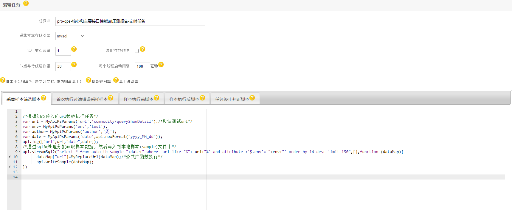
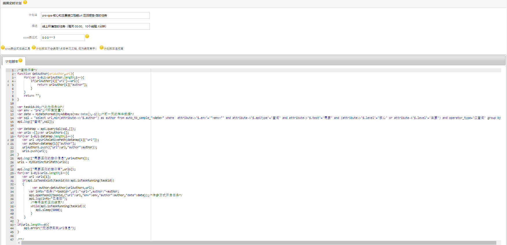
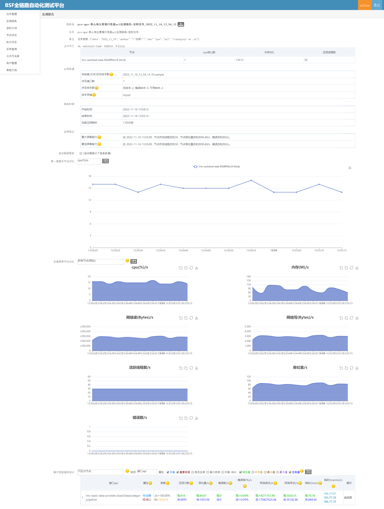
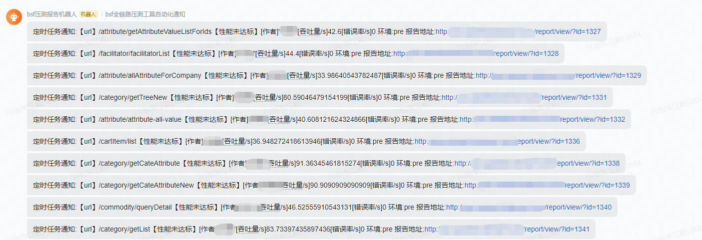

# qps-核心和主要接口性能url压测
[AutoTestAttribute注解](https://gitee.com/chejiangyi/free-bsf-all/blob/1.6-SNAPSHOT/free-bsf-autotest/README.md )的核心和主要接口的定时压测报告,主要解决自动化生成核心和主要接口的性能报告,方便开发人员及时优化。
## 公共函数库
[公共函数库案例](../README-PublicCode.md)
My开头的为自定义的公共函数。

## 压测任务编写
[任务编写案例](/README-Demo.md)
```
/*根据动态传入的url参数执行任务*/
var url = MyApiPsParams('url','commodity/queryShowDetail');/*默认测试url*/
var env= MyApiPsParams('env','test');
var author= MyApiPsParams('author','无');
var date = MyApiPsParams('date',api.nowFormat("yyyy_MM_dd"));
api.log(["url",url,"date",date]);
/*通过sql流处理分批获取样本数据，然后写入到本地样本(sample)文件中*/
api.streamSql2("select * from auto_tb_sample_"+date+" where  url like '%"+ url+"%' and attribute->'$.env'='"+env+"' order by id desc limit 150",[],function (dataMap){
      dataMap["url"]=MyReplaceUrl(dataMap);/*公共库函数执行*/
      api.writeSample(dataMap);
})
```


## 定时计划编写
[计划任务编写案例](/README-Job.md)
```
/*查找作者*/
function GetAuthor(urlAuthor,url){
    for(var i=0;i<urlAuthor.length;i++){
        if(urlAuthor[i]["url"]==url){
            return urlAuthor[i]["author"];
        }
    }
    return "";
}

var taskid=35;/*此为任务id*/
var env = "pre";/*环境变量*/
var date = MyDateFormat(MyAddDays(new Date(),-1));/*前一天的样本数据*/
var sql = "select url,min(attribute->>'$.author') as author from auto_tb_sample_"+date+" where  attribute->'$.env'='"+env+"' and attribute->'$.apiType'='查询' and attribute->'$.test'='需要' and (attribute->'$.level'='核心' or attribute->'$.level'='主要') and operator_type='仅查询' group by url";
api.log(["查询",sql]);

var dataMap = api.querySql(sql,[]);
var urls =[];var urlAuthors=[];
for(var i=0;i<dataMap.length;i++){
   var url =MyUrlRelativePath(dataMap[i]["url"]);
   var author=dataMap[i]["author"];
   urlAuthors.push({"url":url,"author":author});
   urls.push(url);
}
api.log(["需要压测的接口信息",urlAuthors]);
urls = MyDistinctUrlPath(urls);

api.log(["需要压测的接口有",urls]);
for(var i=0;i<urls.length;i++){
   var url =urls[i];
   if(api.isTaskExist(taskid)&&!api.isTaskRunning(taskid))
   {
         var author=GetAuthor(urlAuthors,url);
       var info="任务:"+taskid+",url:"+url+",author:"+author;
       api.openTask2(taskid,{"url":url,"env":env,"author":author,"date":date});/*传参方式开启任务*/
       api.log(info+"已启动");
        /*等待当前压测结束*/
        while(api.isTaskRunning(taskid)){
           api.sleep(5000);
        }
    }
}
if(urls.length==0){
    api.error("无法获取到url信息");
}
```


## 效果图



by [车江毅](https://www.cnblogs.com/chejiangyi/)