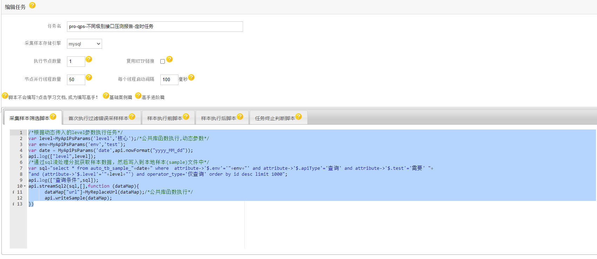
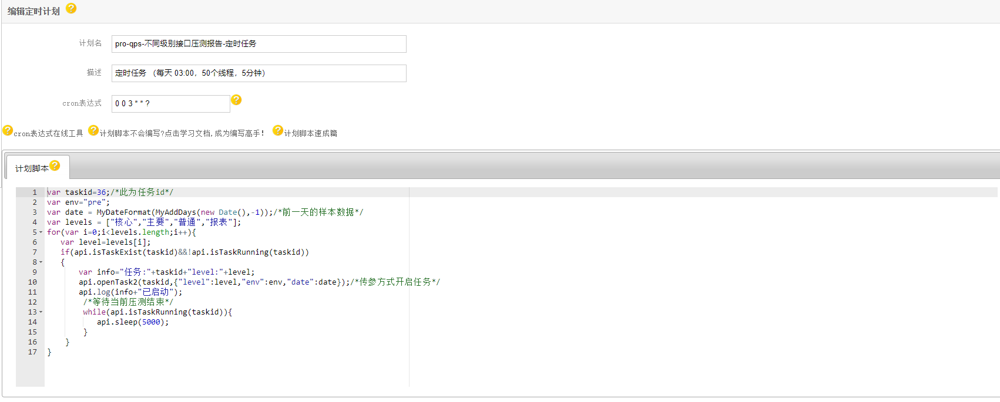
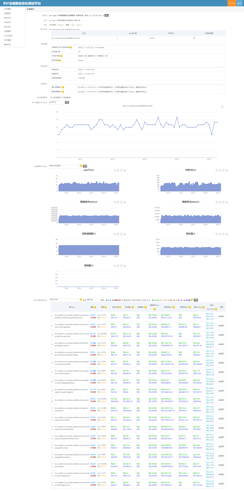

# qps-不同级别接口压测
 [AutoTestAttribute注解](https://gitee.com/chejiangyi/free-bsf-all/blob/1.6-SNAPSHOT/free-bsf-autotest/README.md )的不同等级的接口的定时压测报告,主要解决不同级别的常用接口的性能报告,方便开发人员及时优化。
## 公共函数库
[公共函数库案例](../README-PublicCode.md)
My开头的为自定义的公共函数。

## 压测任务编写
[任务编写案例](/README-Demo.md)
```
/*根据动态传入的level参数执行任务*/
var level=MyApiPsParams('level','核心');/*公共库函数执行,动态参数*/
var env=MyApiPsParams('env','test');
var date = MyApiPsParams('date',api.nowFormat("yyyy_MM_dd"));
api.log(["level",level]);
/*通过sql流处理分批获取样本数据，然后写入到本地样本(sample)文件中*/
var sql="select * from auto_tb_sample_"+date+" where  attribute->'$.env'='"+env+"' and attribute->'$.apiType'='查询' and attribute->'$.test'='需要' "+
"and (attribute->'$.level'='"+level+"') and operator_type='仅查询' order by id desc limit 1000";
api.log(["查询条件",sql]);
api.streamSql2(sql,[],function (dataMap){
      dataMap["url"]=MyReplaceUrl(dataMap);/*公共库函数执行*/
      api.writeSample(dataMap);
})
```


## 定时计划编写
[计划任务编写案例](/README-Job.md)
```
var taskid=36;/*此为任务id*/
var env="pre";
var date = MyDateFormat(MyAddDays(new Date(),-1));/*前一天的样本数据*/
var levels = ["核心","主要","普通","报表"];
for(var i=0;i<levels.length;i++){
   var level=levels[i];
   if(api.isTaskExist(taskid)&&!api.isTaskRunning(taskid))
   {
       var info="任务:"+taskid+"level:"+level;
       api.openTask2(taskid,{"level":level,"env":env,"date":date});/*传参方式开启任务*/
       api.log(info+"已启动");
        /*等待当前压测结束*/
        while(api.isTaskRunning(taskid)){
           api.sleep(5000);
        }
    }
}
```


## 效果图



by [车江毅](https://www.cnblogs.com/chejiangyi/)