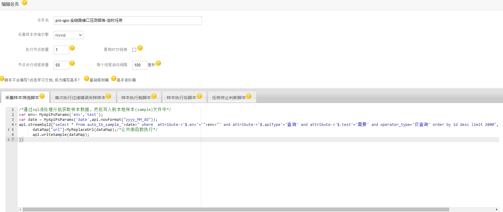
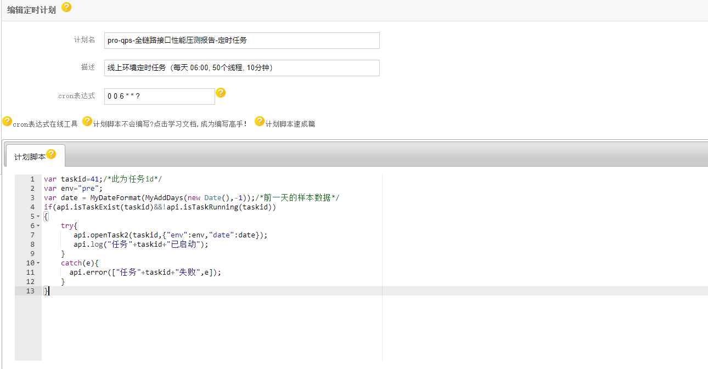
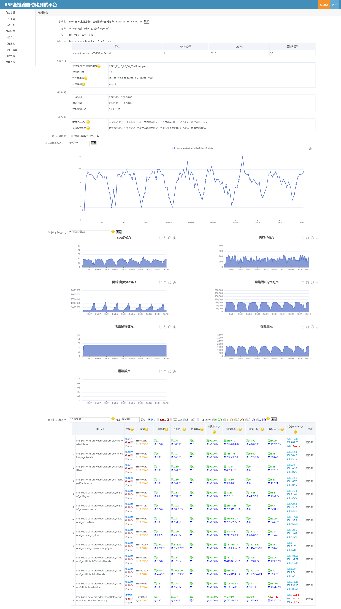

# qps-全链路接口压测
 基于QPS全链路的接口的定时压测报告,主要是了解整体网站qps性能,方便开发人员及时优化。
## 公共函数库
[公共函数库案例](../README-PublicCode.md)
My开头的为自定义的公共函数。

## 压测任务编写
[任务编写案例](/README-Demo.md)
```
/*通过sql流处理分批获取样本数据，然后写入到本地样本(sample)文件中*/
var env= MyApiPsParams('env','test');
var date = MyApiPsParams('date',api.nowFormat("yyyy_MM_dd"));
api.streamSql2("select * from auto_tb_sample_"+date+" where  attribute->'$.env'='"+env+"' and attribute->'$.apiType'='查询' and attribute->'$.test'='需要' and operator_type='仅查询' order by id desc limit 2000",[],function (dataMap){
      dataMap["url"]=MyReplaceUrl(dataMap);/*公共库函数执行*/
      api.writeSample(dataMap);
})
```


## 定时计划编写
[计划任务编写案例](/README-Job.md)
```
var taskid=41;/*此为任务id*/
var env="pre";
var date = MyDateFormat(MyAddDays(new Date(),-1));/*前一天的样本数据*/
if(api.isTaskExist(taskid)&&!api.isTaskRunning(taskid))
{
    try{
       api.openTask2(taskid,{"env":env,"date":date});
       api.log("任务"+taskid+"已启动");
    }
    catch(e){
      api.error(["任务"+taskid+"失败",e]);
    }
}
```


## 效果图



by [车江毅](https://www.cnblogs.com/chejiangyi/)