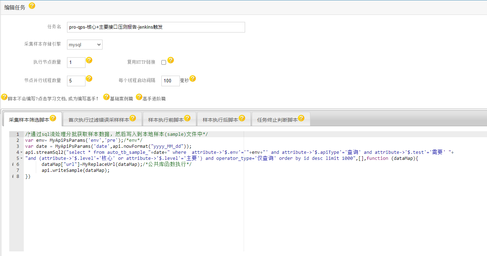
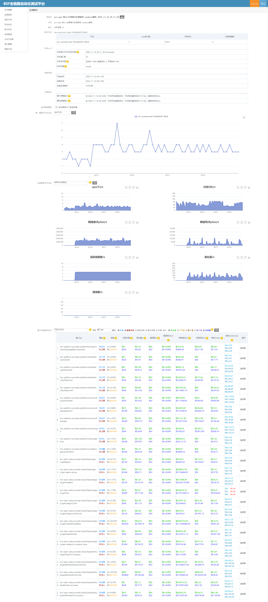
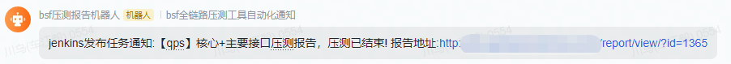

# qps-核心+主要接口压测报告-jenkins触发
 每次jenkins发布触发压测报告,主要是了解整体网站qps性能,方便开发人员及时优化。
## 公共函数库
[公共函数库案例](../README-PublicCode.md)
My开头的为自定义的公共函数。

## 压测任务编写
[任务编写案例](/README-Demo.md)
* 采集样本筛选脚本
```
/*通过sql流处理分批获取样本数据，然后写入到本地样本(sample)文件中*/
var env= MyApiPsParams('env','pre');/*env*/
var date = MyApiPsParams('date',api.nowFormat("yyyy_MM_dd"));
api.streamSql2("select * from auto_tb_sample_"+date+" where  attribute->'$.env'='"+env+"' and attribute->'$.apiType'='查询' and attribute->'$.test'='需要' "+
"and (attribute->'$.level'='核心' or attribute->'$.level'='主要') and operator_type='仅查询' order by id desc limit 1000",[],function (dataMap){
      dataMap["url"]=MyReplaceUrl(dataMap);/*公共库函数执行*/
      api.writeSample(dataMap);
})
```
* 首次执行过滤错误采样样本
```
/*在样本筛选的基础上,对本地样本文件中的部分请求进行过滤，比如特定业务请求或者错误请求或者无法访问的请求等*/
var r = api.ps.response;
if(r==null||r.code!=200)
{
    /*api.error(["过滤错误请求",r]);*/
    return false;
}
var r2 = JSON.parse(r.body);
if(r2==null||r2.code!=200)
{
    /*api.error(["过滤错误业务请求",r]);*/
    return false;
}

/*过滤样本时,减轻被压测端压力*/
/*api.sleep(10)*/
```
* 任务终止判断脚本
```
/*压测时,定期心跳检测当前任务是否符合退出条件，进行任务退出关闭动作，一般会根据压测报告结果或者运行时间进行判断*/
/*此处举例吞吐量超过5000,运行时间超过【5】分钟则终止任务,特别注意nodeReport在任务刚启动的时候可能为null*/
if(api.ps.nodeReport!=null&&(api.ps.nodeReport.throughput>5000||api.ps.runtime>5*60)){
    /*飞书通知*/
    var content = "jenkins发布任务通知:【qps】核心+主要接口压测报告，压测已结束!";
    MyNotify(api.ps.params["env"],content,api.ps.report.id);
    api.log(["结束",api.ps.nodeReport,api.ps.runtime]);
    return false;
}
```


## shell 脚本
注意:shell 使用url get请求的话需要转义,所以采用post模式简单一点;参考[open-api](/README-OpenApi.md)
```
 #注意替换参数
 curl -d 'id=【任务id】&token=【用户token】&username=【用户名】&params={}' -X POST http://【autotest网站地址】/api/openTask/
```

## 效果图



by [车江毅](https://www.cnblogs.com/chejiangyi/)