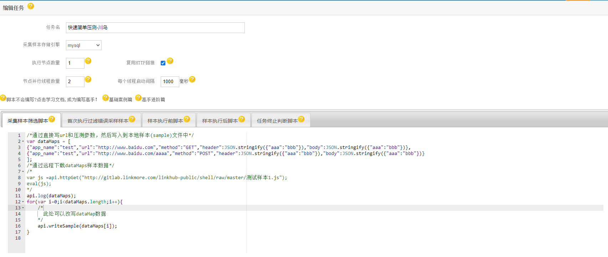
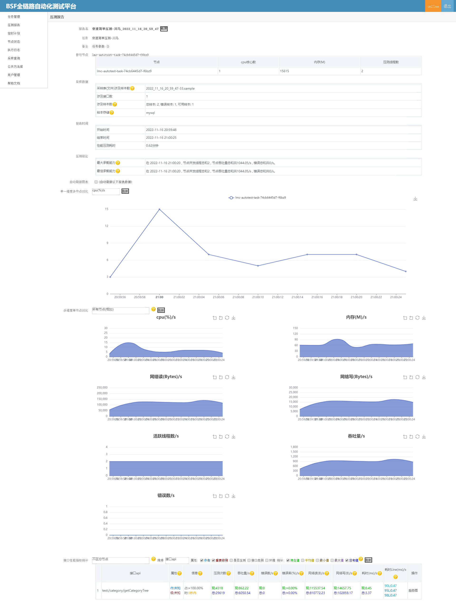

# 小白简单上手压测
 小白直接url参数直接压测,快速出报告,简单快速。
## 说明
通过简单手写或者[远程下载批量](/README-Demo2.md)压测数据,压测出压测报告。当然压测数据也可以通过js脚本灵活改写,同样也可以造数据支持tps压测。

## 压测任务编写
[任务编写案例](/README-Demo.md)
* 采集样本筛选脚本
```
/*通过直接写url和压测参数，然后写入到本地样本(sample)文件中*/
var dataMaps = [
{"app_name":"test","url":"http://10.59.0.60:8080/category/getCategoryTree","method":"POST","header":JSON.stringify({"token": "undefined"}),"body":JSON.stringify({"useDomain":"1"})},
{"app_name":"test","url":"http://www.baidu.com/aaaa","method":"POST","header":JSON.stringify({"aaa":"bbb"}),"body":JSON.stringify({"aaa":"bbb"})}
];
/*通过远程下载dataMaps样本数据*/
/*
var js =api.httpGet("http://gitlab.linkmore.com/linkhub-public/shell/raw/master/测试样本1.js");
eval(js);
*/
api.log(dataMaps);
for(var i=0;i<dataMaps.length;i++){
    /*
      此处可以改写dataMap数据
    */
    api.writeSample(dataMaps[i]);
}


```
* 首次执行过滤错误采样样本
```
/*在样本筛选的基础上,对本地样本文件中的部分请求进行过滤，比如特定业务请求或者错误请求或者无法访问的请求等*/
var r = api.ps.response;
if(r==null||r.code!=200)
{
    /*api.error(["过滤错误请求",r]);*/
    return false;
}
```
* 任务终止判断脚本
```
/*压测时,定期心跳检测当前任务是否符合退出条件，进行任务退出关闭动作，一般会根据压测报告结果或者运行时间进行判断*/
/*此处举例吞吐量超过5000,运行时间超过2分钟则终止任务,特别注意nodeReport在任务刚启动的时候可能为null*/
if(api.ps.nodeReport!=null&&(api.ps.nodeReport.throughput>5000||api.ps.runtime>2*60)){
    api.log(["结束",api.ps.nodeReport,api.ps.runtime]);
    return false;
}
```


## 效果图


by [车江毅](https://www.cnblogs.com/chejiangyi/)