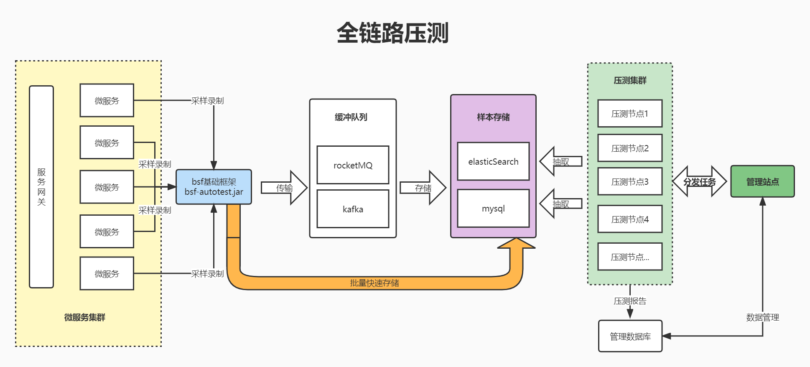
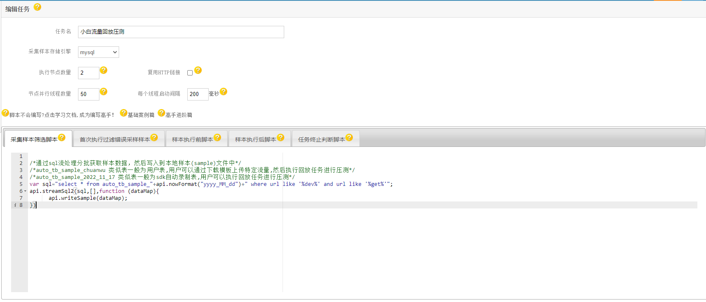
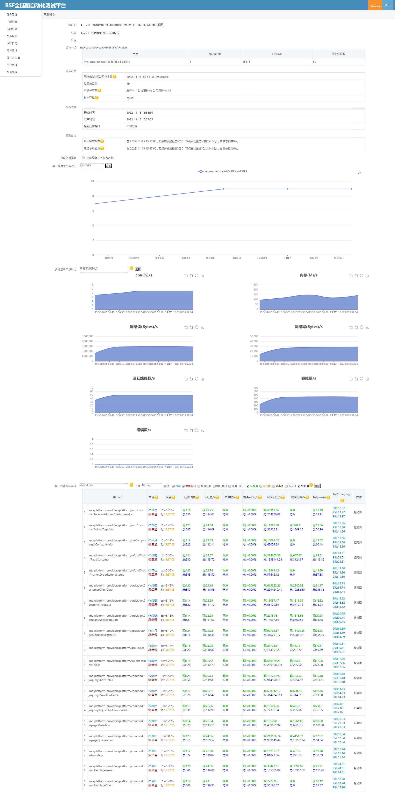

# 小白录制流量压测
 小白实践流量录制后进行批量回放压测。
## 说明
流量录制
* [定制场景录制文档](/README-ModHeader.md)
* [java完整版自动录制样本流量sdk集成](/actual/README-1.md)


## 流量回放压测任务编写
[任务编写案例](/README-Demo.md)
* 采集样本筛选脚本
```
/*通过sql流处理分批获取样本数据，然后写入到本地样本(sample)文件中*/
/*auto_tb_sample_chuanwu 类似表一般为用户表,用户可以通过下载模板上传特定流量,然后执行回放任务进行压测*/
/*auto_tb_sample_2022_11_17 类似表一般为sdk自动录制表,用户可以执行回放任务进行压测*/
/*筛选方式根据需求可以变化,本质上还是通过sql筛选;注意:筛选样本较多的话,压测初始化耗时会比较长一些,要耐心等待!若有异常勤看“执行日志”*/
var sql="select * from auto_tb_sample_"+api.nowFormat("yyyy_MM_dd")+" where url like '%dev%' and url like '%get%'";
api.streamSql2(sql,[],function (dataMap){
      api.writeSample(dataMap);
})
```
* 首次执行过滤错误采样样本
```
/*在样本筛选的基础上,对本地样本文件中的部分请求进行过滤，比如特定业务请求或者错误请求或者无法访问的请求等*/
/*http无法访问的剔除*/
var r = api.ps.response;
if(r==null||r.code!=200)
{
    api.error(["过滤错误请求",r]);
    return false;
}
/*接口返回协议{code:200,msg:"",data:{}},code 非200的剔除;注意：每个公司业务协议都不一样*/
var r2 = JSON.parse(r.body);
if(r2==null||r2.code!=200)
{
    api.error(["过滤错误业务请求",r]);
    return false;
}
/*过滤样本时,减轻被压测端压力;当然目前默认是单线程的过滤*/
/*api.sleep(10)*/
```
* 任务终止判断脚本
```
/*压测时,定期心跳检测当前任务是否符合退出条件，进行任务退出关闭动作，一般会根据压测报告结果或者运行时间进行判断*/
/*此处举例吞吐量超过5000,运行时间超过10分钟则终止任务,特别注意nodeReport在任务刚启动的时候可能为null*/
if(api.ps.nodeReport!=null&&(api.ps.nodeReport.throughput>5000||api.ps.runtime>10*60)){
    api.log(["结束",api.ps.nodeReport,api.ps.runtime]);
    return false;
}
```


## 效果图
类似效果


by [车江毅](https://www.cnblogs.com/chejiangyi/)